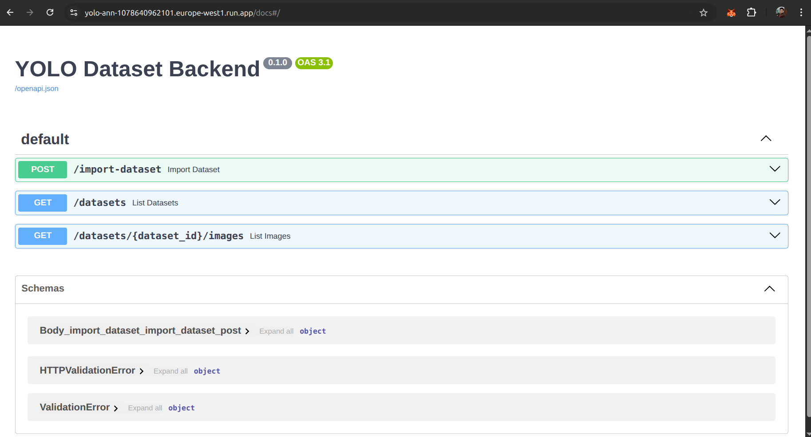
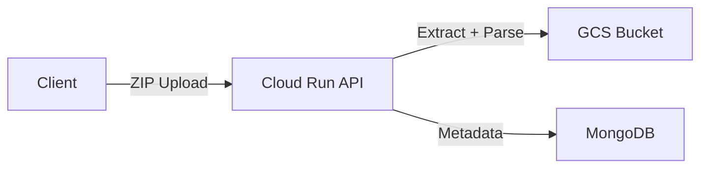
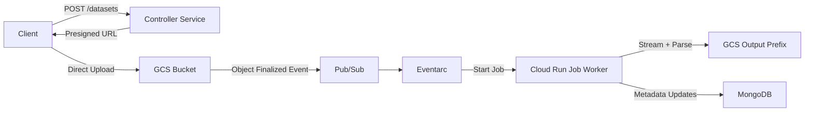

# YOLO Dataset Annotation Backend (GCP + Cloud Run + MongoDB)

---

## **1. Project URLs & Assets**

**Live API URL:**  
[Swagger Docs](https://yolo-ann-1078640962101.europe-west1.run.app/docs)

**Architecture Overview:**  


For detailed screenshots of the project setup and execution, see **[Project Images](project_images.md)**.

---

## **2. Technical Documentation**

### **Tech Stack**

- **Backend**: Python 3.11, FastAPI
- **Storage**: Google Cloud Storage (GCS)
- **Database**: MongoDB Atlas (or self-hosted)
- **Compute**: Google Cloud Run (API) + Cloud Run Job (async worker)
- **Eventing**: Pub/Sub + Eventarc for object finalize triggers

---

### **Current Approach — Synchronous Upload & Parse**



**Endpoints**

- `POST /import-dataset` — upload a ZIP; files to GCS, metadata to MongoDB
- `GET  /datasets` — list datasets (paginated)
- `GET  /datasets/{dataset_id}/images` — list images + labels (filters, pagination, optional `signed_url`)

**Workflow:**

1. `POST /import-dataset` uploads a YOLO ZIP file **directly to the FastAPI service running in Cloud Run**.
2. The API container:
   - Saves the ZIP temporarily in its ephemeral `/tmp` storage.
   - Extracts the contents and parses `classes.txt`, image files, and YOLO label `.txt` files.
   - Uploads the extracted files to **Google Cloud Storage (GCS)** for permanent storage.
   - Writes dataset metadata (dataset name, classes, creation time, file counts) into **MongoDB**.
   - Inserts individual image records with paths and labels into **MongoDB** for efficient querying.

**Technology Choices & Justification:**

- **MongoDB**:
  - Flexible schema to store dynamic label structures and metadata without migration overhead.
  - Fast indexing for queries like “all images of class X in dataset Y”.
  - Supports pagination and filtering with low latency.
- **Google Cloud Run**:
  - Fully managed container execution with zero server management.
  - Autoscaling down to zero when idle saves cost.
  - Works seamlessly with other GCP services (GCS, Pub/Sub, Eventarc).
- **Google Cloud Storage**:
  - Durable, scalable storage for images and label files.
  - Allows direct signed URL access to objects without routing through the API.
  - Integrates with lifecycle management for cost optimization.

**Pros:**

- Clean separation of **metadata (MongoDB)** and **binary assets (GCS)** ensures scalability and lower query load.
- Designed with **indexing strategies** (`dataset_id`, `class_name`) for fast retrieval at scale.
- Uses **stateless service architecture** — API doesn’t depend on local disk beyond `/tmp`.
- Ready for **horizontal scaling** — multiple Cloud Run instances can import datasets concurrently.

**Cons:**

- Limited by Cloud Run’s max request timeout (15 minutes) — not suited for >100 GB datasets.
- Constrained by container memory and ephemeral storage.

---

### **Future Approach — Async Ingestion for 500 GB+**



**Flow:**

1. `POST /datasets` — Controller service creates a dataset record in MongoDB with `status=PENDING` and returns a **presigned resumable upload URL** for GCS.
2. Client uploads ZIP **directly to GCS** (bypasses API to avoid large file uploads through the service).
3. GCS emits an **object finalized** event to a **Pub/Sub topic**.
4. **Eventarc** triggers the controller service, which starts a **Cloud Run Job** worker.
5. The worker:
   - Streams the ZIP from GCS without fully downloading into `/tmp`.
   - Parses YOLO structure (classes, labels, images).
   - Uploads extracted files to a structured GCS path (`datasets/{dataset_id}/`).
   - Optionally runs **YOLOv8 model inference** for validation and statistics.
   - Updates dataset status and metadata in MongoDB.

**Why This Handles 500 GB+ Datasets:**

- **No full ZIP in memory/disk** — streamed processing directly to GCS output paths.
- **Resumable uploads** — clients can retry uploads without restarting the whole process.
- **Decoupled ingestion** — avoids API request timeouts and allows parallel processing.
- Cloud Run Jobs can be configured with **high memory (up to 32 GiB)** and **longer execution times** than HTTP requests.

---

#### Handling 500 GB safely (no `/tmp` bottleneck)

- **Why `/tmp` is risky:** Cloud Run’s writable FS is ephemeral and tied to memory size. Downloading hundreds of GB locally is impractical.
- **Two strategies:**

  **A. Prefer `.tar.gz` for huge datasets**

  - TAR allows sequential streaming: read each entry and immediately write to GCS.
  - Constant memory/disk use.

  **B. Keep `.zip` but avoid staging**

  - Use **GCS FUSE** to mount the bucket and read the ZIP in place.
  - Or **shard the upload** into smaller ZIPs, process each shard in its own Job.

- **Streaming extraction:** Instead of “download → unzip → upload,” pipe each archive entry directly to GCS, parsing labels as they stream.

---

#### Reliability & failure modes

- **Upload interrupted:** Resumable upload resumes; no API involvement.
- **Event delivered twice:** Worker skips already processed files.
- **Worker crash:** Job retries from last checkpoint.
- **Bad archive:** Dataset marked `FAILED` with error reason.

---

#### Observability & SLOs

- **Logs:** Correlate all stages by `dataset_id`.
- **Metrics:** Bytes uploaded, ingestion time p50/p95, error rates.
- **Alerts:** Ingestion latency breaches, repeated job failures, high parse error rate.

---

#### Cost & performance levers

- Right‑size Jobs (CPU/RAM) per dataset size.
- Auto‑delete raw upload objects post‑extraction.

---

## 3. Project Setup (Current Approach)

### Local Development

```bash
python -m venv .venv && source .venv/bin/activate
pip install -r requirements.txt
cp .env.example .env  # then edit values
uvicorn app.main:app --reload --port 8080
```

### Import sample dataset

```bash
python scripts/make_sample_yolo_zip.py out/sample_yolo.zip
curl -X POST http://127.0.0.1:8080/import-dataset -F file=@out/sample_yolo.zip
```

### List

```bash
curl "http://127.0.0.1:8080/datasets?page=1&page_size=20"
curl "http://127.0.0.1:8080/datasets/<dataset_uuid>/images?page=1&page_size=50&class=person&signed_url=true"
```

## Deploy (Cloud Run)

```bash
# Auth & project
gcloud auth login && gcloud auth application-default login
gcloud config set project $PROJECT_ID

# Enable services
gcloud services enable run.googleapis.com cloudbuild.googleapis.com storage.googleapis.com artifactregistry.googleapis.com

# Build & deploy
export IMAGE="europe-west1-docker.pkg.dev/$PROJECT_ID/yolo/yolo-ann:latest"
gcloud artifacts repositories create yolo --repository-format=docker --location=europe-west1 || true
gcloud builds submit --tag $IMAGE

# Service account (runtime) with bucket access
export SA_NAME=yolo-ann-sa
gcloud iam service-accounts create $SA_NAME --display-name "YOLO Ann Service Account" || true
export SA_EMAIL="$SA_NAME@$PROJECT_ID.iam.gserviceaccount.com"
gcloud storage buckets add-iam-policy-binding gs://$GCS_BUCKET \
  --member="serviceAccount:$SA_EMAIL" --role="roles/storage.objectAdmin"

gcloud run deploy yolo-ann \
  --image $IMAGE \
  --region europe-west1 \
  --platform managed \
  --service-account $SA_EMAIL \
  --allow-unauthenticated \
  --set-env-vars GCS_BUCKET=$GCS_BUCKET,MONGO_URI=$MONGO_URI,DB_NAME=$DB_NAME
```
