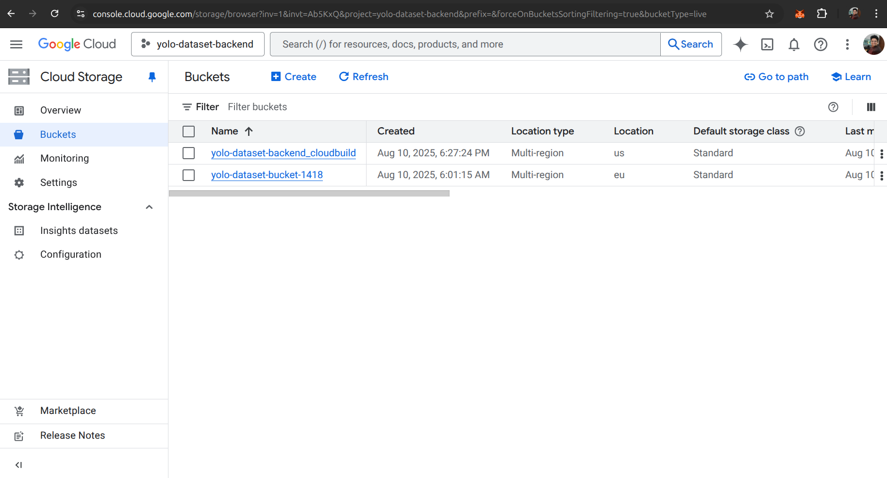

# Project Images

Below are the screenshots for the assignment.

## 1. API Documentation

## 2. MongoDB Images Collection

## 3. MongoDB Collections

## 4. MongoDB Overview

## 5. List Dataset API Response

## 6. List Images API Response

## 7. Google Cloud Run Service

## 8. Google Cloud Project

## 9. Google Cloud Dataset Storage

## 10. Google Cloud Buckets

